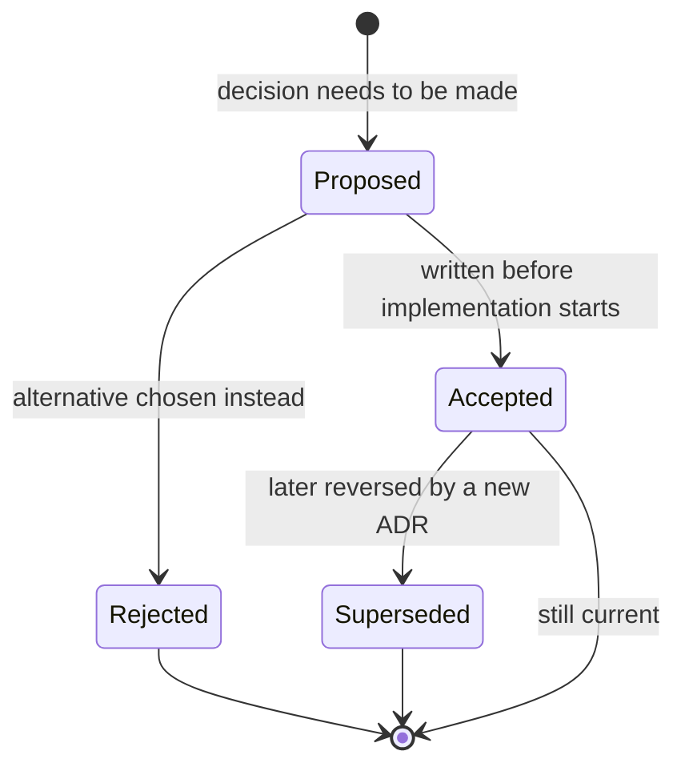

# Contributing

This is a solo-authored systems project (Go control plane, Rust sidecar, Flutter client) built to a professional standard on purpose — the process is part of the portfolio, not overhead around it. This document is binding on **every contributor to this repository, human or AI agent.** There is no separate, looser standard for AI-assisted work.

If you are an AI agent operating in this repository: read this file, `CODE_STYLE.md`, and `docs/TESTING.md` in full before writing any code. They are not background reading — they are the spec you are held to.

---

## 1. Ground Rules

1. **No production code without a failing test first.** This is not a preference, it's the Iron Law: `NO PRODUCTION CODE WITHOUT A FAILING TEST FIRST`. If code was written before its test, delete the code and start over. Keeping it "as reference" is not compliance — see `docs/TESTING.md` for the full TDD workflow and the rationalizations that don't hold up.
2. **Every non-trivial architectural decision gets an ADR before implementation starts, not after.** If you catch yourself justifying a design choice in a PR description instead of an ADR, stop and write the ADR first. See §7.
3. **Every PR is self-reviewed before it's opened.** Solo project, but the discipline of reading your own diff as if someone else wrote it catches real bugs. Use the checklist in the PR template — it is not decorative.
4. **State assumptions explicitly when the blast radius of a change is unclear.** Silent assumptions are how "simple" changes become production incidents. If you don't know what a module's callers expect on failure, say so in the PR description rather than guessing.
5. **Nothing merges with a known gap and a promise to fix it later.** "Works, but needs error handling" is not a mergeable state. Either the work is done or it isn't.

---

## 2. Working With AI Agents in This Repository

This project is built with heavy AI assistance by design, and that assistance is expected to meet the same bar as hand-written code — not a lower one calibrated for speed. If you are an AI agent (or a human prompting one) working in this repo:

- **The `titan-engineer` enforcement layer's Quality Gates are non-negotiable, not stylistic advice.** Error handling, isolation/testability, state safety, observability, naming-for-intent, function/file size limits, and test coverage against enumerated failure scenarios — every gate must pass before code is presented as done. See `CODE_STYLE.md §1` for how these gates map onto Go, Rust, and Dart specifically.
- **TDD is not optional for AI-generated code.** An agent that writes implementation before a failing test is violating the Iron Law exactly as much as a human doing the same. "I wrote comprehensive tests afterward" is explicitly rejected by `docs/TESTING.md` — tests-after prove nothing, because they pass immediately.
- **Do not gold-plate, and do not under-build.** Match the discipline to the scope of the change — a one-off local dev script doesn't need the repository pattern; the batching scheduler's core dispatch loop does need explicit error types and injected dependencies. If you're unsure which side of that line a change falls on, say so in the PR rather than picking silently.
- **Challenge the request when it leads to bad architecture.** If an instruction (from the human owner or from a card's acceptance criteria) would tightly couple business logic to infrastructure, or otherwise violate `CODE_STYLE.md`'s SOLID interpretation, the correct response is to flag the conflict and propose an alternative — not to silently comply and not to silently deviate.
- **Human review and merge authority is retained regardless of how a change was produced.** No PR self-merges without the repo owner's explicit review, including PRs opened by an agent operating autonomously.
- **Attribution:** commits authored substantially by an AI agent should carry a trailer —

  ```text
  Co-Authored-By: Claude <noreply@anthropic.com>
  ```

  — appended to the commit message. This isn't a disclaimer; it's an accurate record, and it's a genuinely useful thing to be able to point to later ("here's my review/edit discipline on AI-assisted work") rather than something to obscure.

---

## 3. Branching & Git Workflow

**GitHub Flow — `main` is always demoable, no `develop` branch.** Full workflow, branch protection settings, merge strategy, and tagging convention live in **`docs/BRANCHING.md`** — read it before your first branch. Rationale for choosing GitHub Flow over GitFlow: `docs/adr/0005-github-flow-over-gitflow.md`.

---

## 4. Commit Messages — Conventional Commits

```text
<type>(<scope>): <subject>

[optional body — explain why, not what]

[optional footer — Closes #123, BREAKING CHANGE: ...]
```

**Types:**

| Type | Use for |
| --- | --- |
| `feat` | New capability |
| `fix` | Bug fix |
| `docs` | Documentation only |
| `style` | Formatting, no logic change |
| `refactor` | Restructuring without behavior change |
| `test` | Adding or fixing tests |
| `chore` | Tooling, deps, config |
| `perf` | Performance improvement |
| `ci` | CI/CD pipeline changes |
| `revert` | Reverting a prior commit |

**Scopes** — match a service or doc area: `gateway`, `auth`, `scheduler`, `worker`, `registry`, `tokenizer`, `observability`, `flutter`, `nginx`, `proto`, `docs`.

```text
feat(scheduler): implement dual-trigger batch dispatch

Batches now close on max-size OR window-expiry, whichever hits first.
Window timer is per-batch-key, not global, so different models don't
block each other's dispatch timing.

Closes #14
```

Subject line: imperative mood, no trailing period, under 50 characters. Body explains *why*, never restates the diff.

---

## 5. Definition of Done

A card is not done until every item below is true — this is the exit gate for every Issue, referenced from every milestone doc:

- [ ] A failing test was written and observed to fail *before* implementation (TDD Iron Law)
- [ ] All tests pass; test output is pristine (no warnings, no skipped cases without a linked issue explaining why)
- [ ] Code passes the language's formatter and linter with zero suppressions added without justification (`CODE_STYLE.md`)
- [ ] Every `titan-engineer` Quality Gate passes: error handling, isolation, state safety, observability, naming, size limits, failure-scenario coverage
- [ ] No `TODO` without a linked GitHub Issue
- [ ] Public contracts (proto messages, exported APIs) that changed have `docs/ARCHITECTURE.md` or the relevant proto comments updated in the same PR
- [ ] An ADR exists for any decision that would surprise a future reader ("why is this in-memory instead of Redis?") — see §7
- [ ] PR opened against the correct milestone, using the PR template, self-review checklist completed

---

## 6. Code Review (Self-Review Process)

Since there's no second reviewer, the PR template's checklist stands in for one — but read the diff as if you're seeing it for the first time, specifically checking for:

- Logic that only makes sense because you remember context that isn't in the code or comments
- Error paths that were tested less thoroughly than the happy path
- A function that grew past ~40 lines or a file past ~300 lines without being split (`CODE_STYLE.md §1`)
- Anything you'd be uncomfortable explaining cold in an interview six months from now

---

## 7. Architecture Decision Records (ADRs)

Write an ADR when a decision would need explaining to a future reader — not for every choice, but for every choice that has a real alternative someone could reasonably ask "why not X instead?" about.

**Lifecycle:** `Proposed` → `Accepted` (or `Rejected`) → optionally `Superseded by ADR-00XX` later if reversed. ADRs are immutable once accepted — a reversed decision gets a *new* ADR that supersedes the old one, the old one is never edited to hide that it existed.



Use `docs/adr/template.md` as the starting point for every new ADR. Number sequentially: `0001-title-in-kebab-case.md`. The full list, with current status, is tracked in `docs/adr/README.md` — update it in the same PR that adds or supersedes an ADR.

---

## 8. Testing Requirements

Full workflow lives in `docs/TESTING.md`. The two rules that matter most, repeated here because they're the ones people rationalize around under deadline pressure:

- **No production code without a failing test first** — no exceptions without explicit sign-off logged in the PR description.
- **Property-based tests are mandatory for the batching scheduler specifically** — its correctness properties (batch never exceeds max size, no request starves past window + dispatch latency, no request is silently dropped under concurrent enqueue) are exactly the class of bug that example-based tests miss.

---

## 9. Local Development

See `docs/RUNBOOK.md` (added once the local `docker-compose` setup exists) for how to run the full stack — nginx, all Go services, the Rust sidecar, and the Flutter client — from a clean checkout.

---

## 10. Questions

This is a solo project — if something in this document is unclear or actively wrong for a situation it didn't anticipate, that's a bug in the document. Open an issue with the `docs` scope, or fix it directly in a PR that also fixes the gap it exposed.
