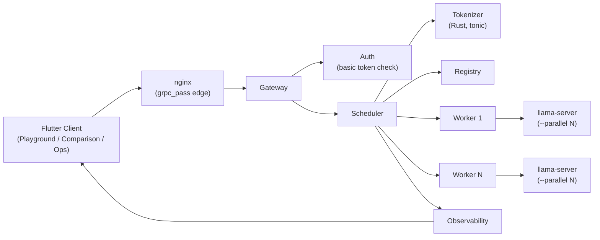
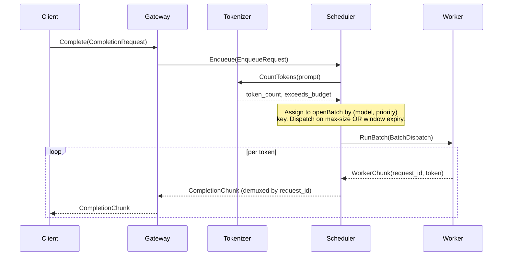

# Architecture

The "how" and "why" of the design. For exhaustive field-level data shapes, see `docs/SCHEMA.md` — this document explains flow and rationale, and only shows fields where they're needed to follow the explanation.

## 1. System Overview



Every arrow is a gRPC boundary except Worker → `llama-server`, which is HTTP (llama.cpp's own API). Services never call each other directly outside this graph — the proto contracts in `docs/SCHEMA.md §1` are the only interface.

## 2. Request Lifecycle



The Tokenizer call is synchronous and on the hot path — it happens before a request is even eligible to join a batch, which is why `docs/CODE_STYLE.md §3` calls out keeping it fast as a real constraint, not a nice-to-have.

## 3. The Scheduler — Core Design

**A batch is a stateful object with a lifecycle, not something popped off a queue one at a time.** The Scheduler owns exactly one open batch per `(model, priority)` key at any moment; everything else — backpressure, session affinity, the dispatch timer — is logic that touches that one object.

Struct definitions: `docs/SCHEMA.md §2`. Main loop, illustrative:

```go
for {
    select {
    case req := <-s.incoming:                  // bounded — this IS backpressure
        key := batchKeyFor(req)
        b := s.openBatches[key]                // created on first request for this key
        b.items = append(b.items, req)
        if len(b.items) >= b.maxSize {
            s.dispatch(b)
        }
    case key := <-s.timerFired:                // per-batch-key timer, window expiry
        s.dispatch(s.openBatches[key])
    case done := <-s.workerDone:
        s.handleCompletion(done)
    }
}
```

Two decisions worth being explicit about:

- **Batch key = `(model, priority)`, not global.** A batch for a 7B model and a batch for a 3B model never share dispatch. This also gives priority isolation for free — interactive and background traffic land in different `openBatch` entries and never block each other.
- **One Scheduler goroutine, no lock on the hot path.** Batch state stays single-threaded by construction; `sync.Mutex` is only needed around the Registry and session-affinity map, which are read/written from outside the main loop (heartbeat updates, sweeper goroutine).

## 4. Session Affinity

`sessionEntry` (shape: `docs/SCHEMA.md §2`) maps `session_id → (workerID, lastActivity)`. On enqueue: if a session has a sticky worker and that worker is `HEALTHY` per the Registry, the batch is assigned to it even if another worker is less loaded. A sweeper goroutine evicts entries past a staleness threshold so the map doesn't grow unbounded over a long-running process. Full rationale and the Redis-vs-in-memory tradeoff: `docs/adr/0001-session-affinity-in-memory-map.md`.

## 5. Backpressure

The Gateway's ingress channel into the Scheduler is bounded. A full channel means the system is genuinely at capacity — the correct response is an immediate `RESOURCE_EXHAUSTED`, not queuing indefinitely and hoping. This is deliberately the *only* backpressure mechanism in the system — no secondary queue anywhere is allowed to grow unbounded as a "just in case" buffer, because an unbounded buffer just moves the failure from a clear rejected-request to a slow, hard-to-diagnose memory leak.

## 6. Worker Service & `llama-server`

llama.cpp's server mode already does slot-based concurrent generation (`--parallel N`). The Worker doesn't reimplement GPU-level batching — it fires N concurrent HTTP requests at a local `llama-server` instance (one per item in the dispatched batch) and demuxes the streamed tokens back over gRPC, tagged by `request_id`. The engineering value in this project is entirely upstream, in the Scheduler's dispatch *decision* — the Worker's job is deliberately dumb execution against an already-competent backend. Stated explicitly here so it doesn't read as a claim to have built GPU-level batching, which isn't what this is.

## 7. Rust Tokenizer Sidecar

Hand-rolled BPE (encode/decode against a bundled public vocab/merges file) rather than the `tokenizers` crate — rationale: `docs/adr/0002-hand-rolled-bpe-over-crate.md`. Exposed as a separate `tonic` gRPC service rather than an FFI/cgo binding into the Go process — rationale: `docs/adr/0003-rust-tokenizer-as-grpc-service.md`. The BPE core (merge-rule application, vocab lookup) is kept as pure functions, independent of the `tonic` service wrapper, so it's testable with zero gRPC machinery involved — per `CODE_STYLE.md §1`'s Testability pillar.

## 8. Reliability

On worker crash (missed heartbeats past threshold, Registry marks it `UNREACHABLE`): any batch dispatched to that worker with requests still in flight is requeued to a healthy worker. This is at-least-once, not exactly-once — a client may observe a stream restart rather than a seamless resume, but never silent loss. Full rationale for accepting this tradeoff over a distributed-transaction/dedup approach: `docs/adr/0004-at-least-once-retry-semantics.md`.

## 9. Observability

What's actually measured, and why each metric earns its place (no vanity metrics):

| Metric | Why it matters |
|---|---|
| Batch size at dispatch (per model/priority) | Direct evidence the batching thesis works — this is the number that proves the project, not a nice chart |
| Queue depth (open batch size before dispatch) | Leading indicator of approaching backpressure |
| Dispatch latency (enqueue → batch-close) | The latency cost the batching strategy actually imposes — has to be honestly reported, including when it's bad |
| Worker health / heartbeat age | Feeds the Ops dashboard's failure-recovery demo |

These feed the Flutter Ops dashboard (M4) and get recorded with real numbers in `docs/PERFORMANCE.md` once M5's load testing runs. No separate `OBSERVABILITY.md` — this section is the complete design; splitting it out would fragment a small system's docs across more files than the content justifies.

## 10. Trust Boundaries

The Gateway is the only externally-reachable service; nginx terminates the edge. FR-2's static token check is the only auth in scope — see `docs/PRD.md §5` for what's explicitly excluded (OAuth, per-user quotas, multi-tenant isolation). No separate `SECURITY.md`: there's no external vulnerability-disclosure process to define for a solo repo, and this paragraph is the entire threat-boundary discussion worth having at this scope.

## 11. Deployment Topology

Local-first: all services run as separate processes (or `docker-compose` for the demo-able end state) on one machine. No remote deployment target is in scope — see `docs/PRD.md §5`. Concrete run instructions: `docs/RUNBOOK.md`, written once the `docker-compose` setup exists.
