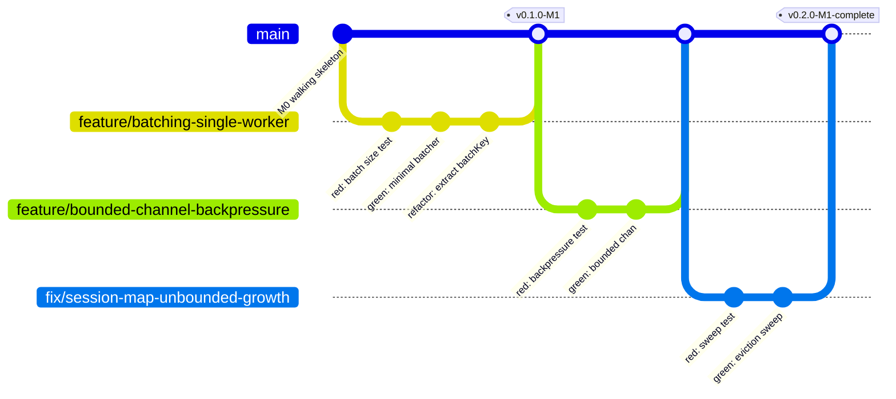

# Git Branching Strategy

This is the authoritative reference for how branches, commits, merges, and releases work in this repository. `CONTRIBUTING.md §3` summarizes it; this document is the full version. See `docs/adr/0005-github-flow-over-gitflow.md` for why this model was chosen over GitFlow or full trunk-based development.

---

## 1. The Model: GitHub Flow

One rule underpins everything else: **`main` is always demoable.** There is no `develop` branch buffering unstable work, because there's no second team whose in-flight work `develop` would need to isolate from a scheduled release. Every branch off `main` is short-lived and exists for exactly one card.



---

## 2. Branch Naming

`<type>/<short-kebab-case-description>` — type matches the commit-type table in `CONTRIBUTING.md §4`:

| Prefix | Use |
| --- | --- |
| `feature/` | New capability, matches a Feature/Task card |
| `fix/` | Bug fix, matches a Bug Report card |
| `refactor/` | Restructuring, no behavior change |
| `test/` | Test-only additions (e.g., backfilling property tests) |
| `docs/` | Documentation only |
| `chore/` | Tooling, CI, dependency bumps |

Examples: `feature/scheduler-multi-worker-dispatch`, `fix/tokenizer-empty-string-panic`, `docs/architecture-batching-diagram`.

---

## 3. Branch Protection Rules (configure on `main`)

Set these under repo Settings → Branches → Branch protection rules, on `main`:

- [ ] Require a pull request before merging (no direct pushes, including from the owner)
- [ ] Require status checks to pass before merging — once CI exists (`gofmt`/`clippy`/`dart analyze` + tests + `buf breaking`)
- [ ] Require conversation resolution before merging
- [ ] Require branches to be up to date before merging (forces the rebase step in §4)
- [ ] Require linear history (blocks merge commits that aren't fast-forward-compatible — enforces the squash policy in §5)
- [ ] Do not allow force pushes to `main`
- [ ] Automatically delete head branches after merge (stops dead branches accumulating — see §7)

---

## 4. The Workflow, Step by Step

1. Pick a card from the board. Confirm it has acceptance criteria and a milestone (the issue form makes this unskippable).
2. `git checkout main && git pull && git checkout -b feature/<description>`
3. TDD cycle per `docs/TESTING.md`: red → green → refactor, committing at meaningful checkpoints (a red/green/refactor sequence is often worth 3 small commits rather than one large one — it documents the process).
4. Before opening a PR: `git fetch origin && git rebase origin/main` — resolve conflicts locally, never in the PR.
5. Push, open a PR using `.github/PULL_REQUEST_TEMPLATE.md`, complete the self-review checklist honestly.
6. Merge (see §5 for squash vs. merge-commit). Branch auto-deletes per the protection rule above.
7. If this closes a milestone, tag the release (§6).

---

## 5. Merge Strategy

**Default: squash merge.** One card → one commit on `main`, commit message rewritten to the conventional-commit format from `CONTRIBUTING.md §4` regardless of how messy the branch's internal history was.

**Exception:** if a branch's individual commits are independently meaningful as a record (a clean red/green/refactor sequence you want preserved for its own documentation value, e.g. on the batching scheduler's core logic), use a regular merge commit instead. This is a judgment call, not a rule — default to squash unless you have a specific reason not to.

---

## 6. Tagging & Releases

Tag at every milestone close: `vX.Y.0-<milestone-id>`, e.g. `v0.1.0-M0`, `v0.2.0-M1`. Annotated tags, not lightweight:

```bash
git tag -a v0.2.0-M1 -m "M1 complete: core scheduler with batching, backpressure, session affinity"
git push origin v0.2.0-M1
```

The tag is the milestone's proof of completion — it's what `docs/milestones/M1-core-scheduler.md`'s closeout note links to, and what `CHANGELOG.md` is generated against.

---

## 7. Handling a Broken `main`

Solo project, so "broken main" means a merged PR passed self-review but broke something anyway. Policy: **revert first, fix properly second.** Don't try to hot-patch forward under pressure — `git revert` the merge commit, restore a demoable `main`, then reopen the fix as a normal branch with its own TDD cycle. A rushed forward-fix is how a second bug gets introduced on top of the first.

---

## 8. Branch Hygiene

Auto-delete-on-merge (§3) handles the common case. Periodically (e.g., at each milestone boundary): `git branch -r --merged main` to confirm nothing stale survived, and delete any branch abandoned mid-work for more than a couple of weeks — either finish it or delete it, a half-done branch sitting for a month is scope creep in git form.
