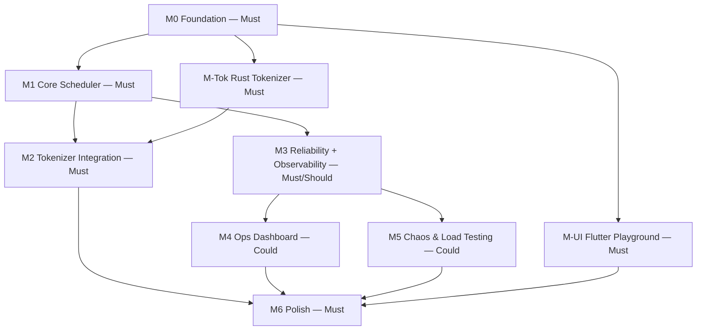

# Product Requirements Document

## 1. Problem & Goals

Full vision, motivation, and prior art comparison live in the original project overview. Condensed thesis: **the infrastructure is the project, not the model.** A capable-enough small model running behind a scheduler that demonstrates real dynamic batching, real backpressure, and real graceful degradation under failure is a stronger systems-engineering artifact than a bigger model behind a naive request-response wrapper.

Goals, in order of what the project is actually trying to prove:
1. A batching scheduler whose correctness properties are provable, not just plausible (property-based tests, not vibes)
2. A polyglot service boundary (Go control plane ↔ Rust tokenizer) designed and versioned like a real distributed system, not a monolith with a library call
3. Visible failure handling — a worker can die mid-batch and the system demonstrably recovers, on camera
4. A client that makes the above legible to someone watching, not just correct in logs

## 2. MVP Scope (MoSCoW)

| Tier | Item | Why |
|---|---|---|
| Must | M0 Foundation — proto, service skeletons, nginx, walking skeleton | Nothing exists without it |
| Must | M1 Core Scheduler — batching, backpressure, multi-worker + session affinity | This is the thesis |
| Must | M-Tok Rust Tokenizer sidecar (hand-rolled BPE) | Second independent proof of cross-language service design — promoted to Must, see `docs/adr/0002` and `0003` |
| Must | M2 Tokenizer Integration | Wires M-Tok into the enqueue path |
| Must | Basic reliability — retry/requeue on worker crash | Without it, "handles failure" is a claim, not a fact |
| Must | M-UI Flutter Playground (streaming reveal, model selector) | Proves the client is real |
| Must | Property-based tests on the batcher | Correctness backbone, not polish — see `docs/TESTING.md` |
| Should | M3 Observability service + real metrics | Feeds M4 honestly; not required for the thesis itself |
| Could | M4 Ops Dashboard, Comparison View | Real differentiator, but only after Should items feed it |
| Could | M5 Chaos & load test suite | Valuable; a documented manual failover check is an acceptable fallback if time runs out |
| Won't | KV-cache introspection, service mesh, horizontal scheduler sharding | "What I'd do at scale" interview answers, not build targets |

## 3. Functional Requirements

| ID | Requirement | Acceptance Criteria |
|---|---|---|
| FR-1 | Gateway accepts client streaming completion requests | Client opens `Complete()`, receives `CompletionChunk`s in order |
| FR-2 | Gateway validates a basic auth token before accepting a stream | Missing/invalid token → immediate `UNAUTHENTICATED`, no downstream dispatch |
| FR-3 | Ingress applies backpressure via a bounded channel | Under saturation, new requests receive `RESOURCE_EXHAUSTED` immediately, never hang |
| FR-4 | Scheduler batches per (model, priority) using a dual trigger | Batch closes on max-size OR window-expiry, whichever hits first — verified by property test, not just example tests |
| FR-5 | Scheduler maintains session affinity | N consecutive requests from one `session_id` land on the same worker while it's healthy |
| FR-6 | Scheduler requeues in-flight requests on worker crash | A killed worker's in-flight batch is observed to complete via a different worker — no silent loss |
| FR-7 | Worker executes a dispatched batch and demuxes the token stream | N concurrent requests in one batch each receive only their own tokens, correctly ordered |
| FR-8 | Tokenizer counts tokens and flags budget overruns pre-enqueue | `token_count` matches a reference tokenizer within an agreed tolerance on a fixed test corpus; `exceeds_budget` correctly flags over-limit prompts |
| FR-9 | Registry tracks worker health via heartbeat | A worker missing N consecutive heartbeats is marked `UNREACHABLE`, excluded from new dispatch |
| FR-10 | Observability emits real scheduler metrics | Batch size, queue depth, dispatch latency reflect actual state under load, not stubbed values |
| FR-11 | Playground shows token-by-token streaming reveal with model selection | Tokens render incrementally as received, not buffered to stream close |
| FR-12 | Ops dashboard displays live metrics from Observability | Dashboard values change visibly under synthetic load |

Full data shapes backing these requirements: `docs/SCHEMA.md`. Design rationale: `docs/ARCHITECTURE.md`.

## 4. Non-Functional Requirements

| Category | Target | Notes |
|---|---|---|
| Latency | Batch dispatch decision (enqueue → batch-close) within the configured window for interactive priority | Actual measured numbers, not aspirational ones, recorded in `docs/PERFORMANCE.md` once M5 produces data |
| Throughput | Sustain N concurrent streams without request loss | N is hardware-bound (single RTX 3050, 4GB VRAM) — measure, don't assume; record in `docs/PERFORMANCE.md` |
| Reliability | Zero silent request loss on worker crash | At-least-once semantics, `docs/adr/0004` |
| Testability | Every module verifiable in isolation, no live network/process required | Enforced via `titan-engineer` Quality Gates, `CODE_STYLE.md §1` |
| Observability | Every failure path emits structured, traceable context | `CODE_STYLE.md §1`, Debuggability pillar |

## 5. Explicit Out of Scope

- Real KV-cache paging/introspection (PagedAttention-style) — llama.cpp's existing slot handling is used as-is, not reimplemented
- Horizontal scheduler sharding / multi-instance coordination — single Scheduler process for the life of this project
- Exactly-once delivery via distributed transactions or a dedup log — at-least-once is the accepted tradeoff, `docs/adr/0004`
- Service mesh, multi-tenant auth (OAuth, per-user quotas) — a single static token is sufficient for FR-2
- Horizontal worker autoscaling — worker count is fixed/manual for this project's scope

## 6. Milestone Map

Per-milestone exit criteria and card breakdown: `docs/milestones/` (written just before each phase starts, not upfront). External status view: `docs/ROADMAP.md`.

## 7. Open Risks

| Risk | Mitigation |
|---|---|
| Hardware ceiling (4GB VRAM) limits concurrent batch size enough that "batching under load" is hard to demonstrate convincingly | Choose a small enough quantized model that meaningful concurrency (≥4-8 simultaneous streams) fits; record the actual ceiling in `docs/PERFORMANCE.md` rather than assuming one upfront |
| Solo bandwidth is a single point of failure against a fixed external timeline | Kanban WIP limit + milestone checkpoints (`docs/ROADMAP.md`) surface slippage early instead of at the end |
| Scope creep re-expanding a cut "Could" item mid-build | MVP tiering in §2 is the enforcement mechanism — a Could item doesn't start until every Must item in its dependency chain is closed |
| Rust tokenizer correctness (hand-rolled BPE) silently diverging from a reference implementation | FR-8's acceptance criteria requires testing against a reference tokenizer's output, not just "it runs" |
