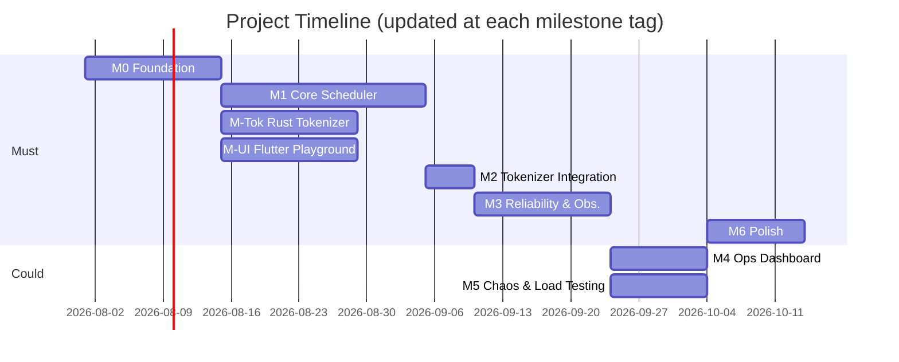

# Roadmap

External-facing status view — for the detailed dependency graph and MoSCoW scope tiers behind these milestones, see `docs/PRD.md §6`. For a milestone's exit criteria and card breakdown, see `docs/milestones/`. This file doesn't decide anything; it reflects decisions made there.

**Update the status column in the same PR/commit that tags a milestone release** (`docs/BRANCHING.md §6`) — this table should never be stale relative to the tags.

## Vision

The infrastructure is the project, not the model — see `docs/PRD.md §1`.

## Status

| Milestone | Tier | Status | Tag |
| --- | --- | --- | --- |
| M0 — Foundation | Must | ✅ Complete | `v0.1.0-M0` |
| M1 — Core Scheduler | Must | 🚧 In Progress | — |
| M-Tok — Rust Tokenizer Sidecar | Must | ⏳ Planned | — |
| M-UI — Flutter Playground | Must | ⏳ Planned | — |
| M2 — Tokenizer Integration | Must | ⏳ Planned | — |
| M3 — Reliability & Observability | Must / Should | ⏳ Planned | — |
| M4 — Ops Dashboard & Comparison View | Could | ⏳ Planned | — |
| M5 — Chaos & Load Testing | Could | ⏳ Planned | — |
| M6 — Polish | Must | ⏳ Planned | — |

`⏳ Planned` → `🚧 In Progress` → `✅ Complete`

Dates are placeholders — set real ones once M0 actually starts, and treat drift on this chart as a signal worth a milestone closeout note, not something to quietly redraw.
