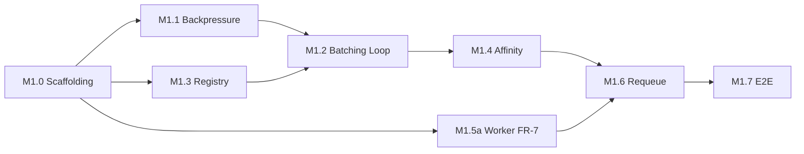

# M1 — Core Scheduler

**Status:** Not started
**Depends on:** M0 — Foundation (see `docs/PRD.md §6`)
**Unlocks:** M2, M3 (see `docs/PRD.md §6`)

## Goal

Transform the M0 passthrough scheduler into a dynamic batching engine whose correctness is provable: requests grouped by (model, priority), dispatched on dual trigger (max batch size or timer window expiry), strict backpressure via a bounded ingress channel, session affinity with TTL eviction, multi-worker dispatch with concurrent token demux, and at-least-once requeue on worker failure. Every behavioral claim is verified by a property-based test written before the implementation.

## Entry Criteria

- M0 tagged v0.1.0-M0 (✅)
- All four proto files lint-clean (✅)
- Go services skeleton + e2e smoke test passing (✅)

## Exit Criteria (Definition of Done for this milestone)

- [ ] Bounded ingress channel rejects with `RESOURCE_EXHAUSTED` on saturation (FR-3) — property-verified
- [ ] Dual-trigger batch dispatch per (model, priority): max-size OR window-expiry (FR-4) — property-verified
- [ ] Worker executes multi-item batches concurrently, demuxes tokens by request_id (FR-7)
- [ ] Session affinity routes sticky sessions to healthy workers, TTL eviction sweeps stale entries (FR-5) — property-verified
- [ ] Worker crash/stream-error requeues in-flight requests to a healthy worker — no silent loss (FR-6)
- [ ] In-memory worker registry tracks health via heartbeat; sweeper marks UNREACHABLE (FR-9)
- [ ] Five property-based invariants pass: batch never exceeds maxSize, no request held past window+overhead, no silently dropped requests under concurrent enqueue, session affinity holds unless worker unhealthy, batch key isolation
- [ ] E2E smoke test updated and passing with multi-worker batching + real Worker
- [ ] `docs/SCHEMA.md` and `docs/ARCHITECTURE.md` updated for new state shapes
- [ ] Two new ADRs drafted and accepted: ADR-0008 batch key as struct, ADR-0009 in-memory registry scoping
- [ ] Tagged v0.2.0-M1

## Cards

Filed as GitHub Issues using `.github/ISSUE_TEMPLATE/feature_task.yml`, milestone set to `M1 - Core Scheduler`:

| # | Card | Scope | Summary |
|---|---|---|---|
| M1.0 | Test scaffolding | scheduler | `rapid` dependency, `TimeSource` interface + `FakeTimeSource`, shared generators, `recordingDispatcher` mock |
| M1.1 | Bounded ingress & backpressure | scheduler | Bounded channel rejects with `RESOURCE_EXHAUSTED` on saturation. property test RED → GREEN |
| M1.2 | Event loop & dual-trigger batching | scheduler | Single-goroutine `run()` loop, `openBatches` map, timer-per-batch-key via context-owned goroutine, demux tokens by `request_id`. property tests RED → GREEN |
| M1.3 | Worker registry & heartbeat | registry | In-memory map + `sync.Mutex`, `Register`/`Heartbeat`/`Sweep`/`HealthyWorkers` methods. unit tests RED → GREEN |
| M1.4 | Session affinity & TTL sweeper | scheduler | `sessionEntry` map, sticky routing, TTL eviction sweeper goroutine. property test RED → GREEN |
| M1.5a | Worker multi-item concurrent execution | worker | `errgroup` with N goroutines, per-request channels, single demux goroutine for `stream.Send()`. unit tests RED → GREEN |
| M1.6 | Worker crash recovery & requeue | scheduler | `collectInFlight` on stream error, re-enqueue to healthy worker. unit tests RED → GREEN |
| M1.7 | E2E smoke test update | smoke | Multi-worker batching topology with real Worker, not just mocks |

> **Note: FR-6 (requeue on worker crash) is mapped to M3 in `docs/PRD.md §6`. It is pulled into M1 deliberately because multi-worker dispatch (FR-4, FR-5) cannot be demonstrated as correct without handling the case where a dispatched worker dies. Deferring crash recovery to M3 would leave M1's multi-worker path untestable against its own acceptance criteria. This is a conscious scope decision, not drift.**

### Server.go changes

Progressive replacement across M1.1–M1.6. No single commit deletes old code and adds new code simultaneously.

### Timer design

Timer-per-batch via `TimeSource.NewTimer` + context-owned goroutine, not a naked goroutine.

### Non-sticky routing

Non-sticky requests are dispatched to a uniformly random healthy worker from `Registry.HealthyWorkers()`. Least-loaded selection is deferred to M3 when load metrics exist.

### Implementation Order

## Relevant PRD / Architecture Sections

- `docs/PRD.md`: FR-3, FR-4, FR-5, FR-6, FR-7, FR-9
- `docs/ARCHITECTURE.md §3` (Scheduler), `§4` (Session Affinity), `§5` (Backpressure), `§6` (Worker), `§8` (Reliability)
- `docs/TESTING.md §2` (property-based invariants)
- `docs/adr/0001-session-affinity-in-memory-map.md`
- `docs/adr/0004-at-least-once-retry-semantics.md`
- `docs/adr/0008-batch-key-as-struct.md`
- `docs/adr/0009-in-memory-registry-for-m1.md`

## Retro

*(filled in when this milestone closes — what shipped, what got cut, one thing to do differently)*
