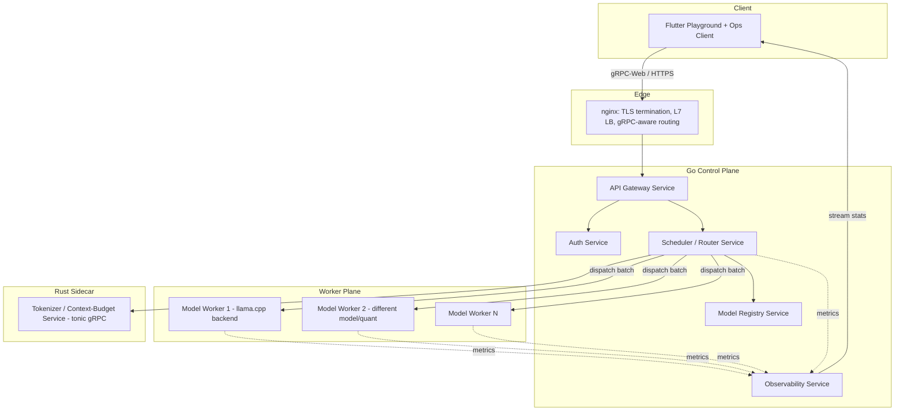
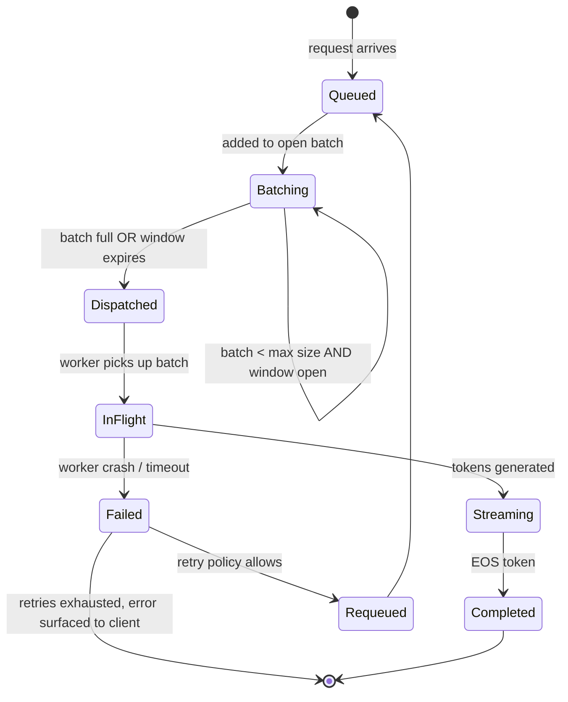
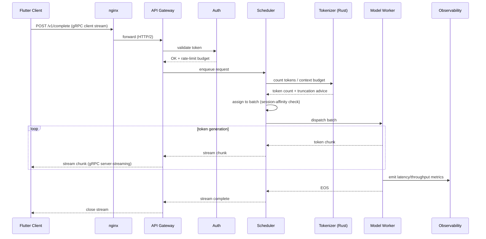
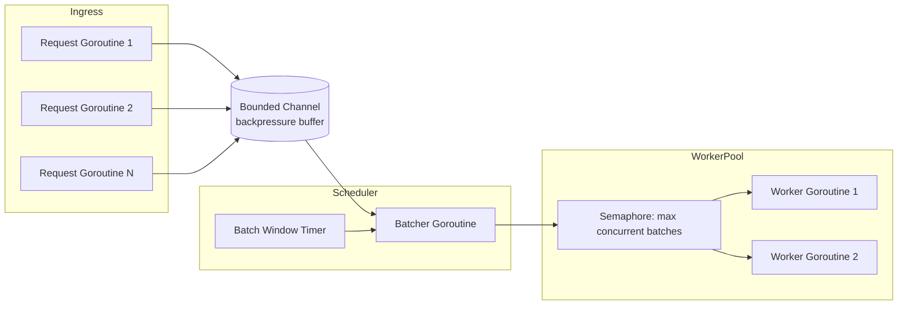
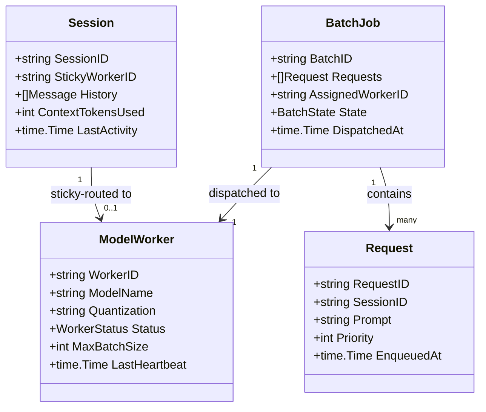
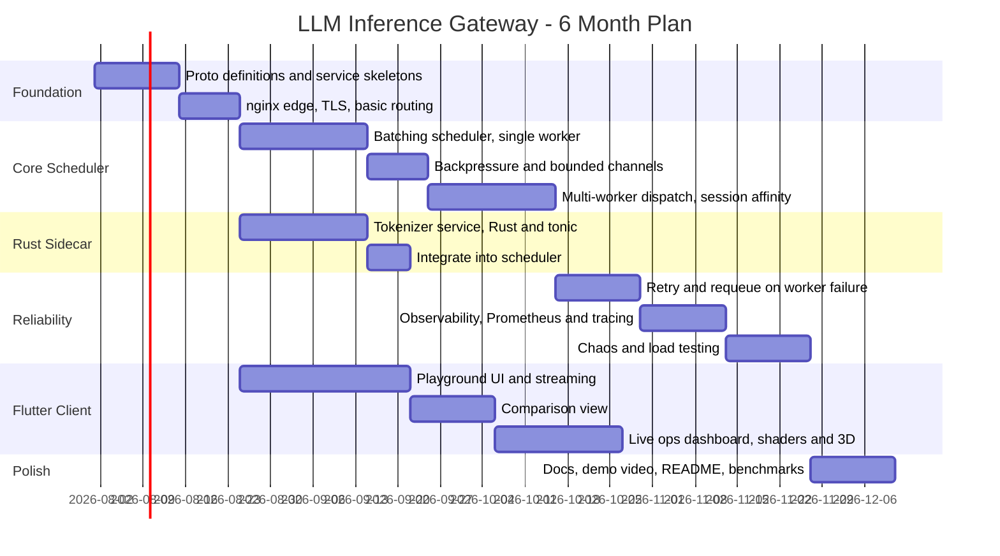

# LLM Inference Gateway & Serving Platform

*A Go-native, gRPC-first control plane for LLM inference — dynamic batching, cache-aware routing, and a Flutter ops/playground client.*

---

## 1. Executive Summary

Most "AI portfolio projects" are thin wrappers around an API call to a hosted model. This is the opposite: **the model is the boring part, the infrastructure around it is the project.** You build the control plane that a real inference platform (vLLM, Bifrost, GKE Inference Gateway) needs — request batching under concurrency, backpressure, session-affinity routing, failure recovery — using your own hardware as the worker fleet. It's backend-concentrated from day one: Go concurrency, gRPC streaming, microservices, nginx, with a Rust sidecar and a fully-featured Flutter client layered on top.

**What it proves:** you can design and build the unglamorous, load-bearing infrastructure layer of a system — not just call an API and format the output.

---

## 2. Context & Goals

**The problem this project solves (for real, not hypothetically):** naive LLM serving — one process, round-robin requests — falls over under concurrent load in two specific ways: (1) GPU/CPU sits idle between requests when it could be batching them together, and (2) every request pays the full cost of re-processing shared context (system prompts, conversation history) because nothing is cache-aware. Production gateways solve this with dynamic batching and cache-aware routing. You're building a scoped-down but *real* version of that.

**Goals:**

- Concurrency-heavy Go service (batching scheduler) as the technical centerpiece
- Real microservices: gateway, auth, scheduler, model registry, observability — talking gRPC
- nginx as genuine edge infrastructure (TLS termination, L7 routing, timeouts tuned for streaming)
- A Rust component that is a real cross-language *service*, not just FFI glue
- A Flutter client that is genuinely useful (playground + live ops dashboard), not a bolt-on demo

**Non-goals:** you are not writing CUDA kernels or reimplementing vLLM's PagedAttention. The worker processes wrap an existing inference backend (llama.cpp / Ollama, which you already have hands-on experience tuning on your RTX 3050). The engineering value is entirely in the orchestration layer.

**Target roles:** primarily backend/Go SWE. The Flutter client is a genuine secondary showcase, not a fig leaf — it should be demoable to a non-technical interviewer in 30 seconds.

---

## 3. High-Level Architecture

---

## 4. The Hard Part: The Batching Scheduler

This is the piece that makes the project real instead of decorative. Requests arrive concurrently and independently. The scheduler must:

- Group requests into a batch, bounded by **either** a max batch size **or** a max wait window (whichever hits first) — classic time/size dual-trigger batching
- Never let a request wait indefinitely (starvation is a correctness bug, not a performance nit)
- Apply backpressure once queue depth exceeds capacity, rather than accepting unbounded work
- Support priority tiers (interactive vs. batch/background), mirroring how production inference gateways assign request criticality so latency-sensitive traffic doesn't queue behind bulk jobs

---

## 5. Session-Affinity (Cache-Aware) Routing

Real KV-cache-aware routing (like GKE's Inference Gateway) inspects live GPU memory state. You don't have a GPU cluster, so you build the honest, scoped-down version: **sticky routing by conversation/session ID.** Once a session lands on worker W, subsequent turns route back to W so the backend's own context cache (llama.cpp keeps a KV cache per loaded context) stays warm. Document this explicitly as a simplification — it's the same idea, at the scale your hardware actually supports, and being upfront about that scoping decision is itself a good interview answer.

Fallback rule: if the sticky worker is unavailable or overloaded, route to least-loaded worker and accept the cold-cache cost — this fallback path is exactly the kind of edge case worth writing a test for.

---

## 6. Request Sequence — Streaming Completion

---

## 7. Microservice Responsibilities

| Service | Language | Responsibility | Talks to (gRPC) |
| --- | --- | --- | --- |
| API Gateway | Go | Request validation, auth delegation, response streaming to client | Auth, Scheduler |
| Auth | Go | API keys, rate-limit budgets, JWT validation | Gateway |
| Scheduler / Router | Go | Batching, backpressure, session-affinity routing, retry/requeue | Tokenizer, Registry, Workers |
| Model Registry | Go | Tracks live workers, model/quant metadata, health checks | Scheduler |
| Model Worker(s) | Go (wraps llama.cpp/Ollama) | Executes a batch, streams tokens back | Scheduler |
| Tokenizer/Context-Budget | Rust (tonic) | Fast token counting, context-window budget calc | Scheduler |
| Observability | Go | Aggregates Prometheus metrics, structured logs, exposes stream for dashboard | All services (metrics push) |

---

## 8. Concurrency Model (Go)

- One goroutine per accepted stream reads requests into a **bounded channel** — this *is* your backpressure mechanism; when it's full, new requests get an immediate "server busy" response instead of piling up unbounded
- A dedicated batcher goroutine (or one per model, if you shard by model) drains the channel and applies the size/window dual trigger
- Worker dispatch uses a semaphore-bounded worker pool so you never oversubscribe your actual hardware
- `context.Context` carries cancellation/deadlines end-to-end so a client disconnect actually frees worker capacity instead of leaking it
- `sync.WaitGroup` (or errgroup) tracks in-flight batch completion for graceful shutdown

---

## 9. Data Model (Registry & Session State)

---

## 10. Rust Component: Tokenizer / Context-Budget Sidecar

Go's tokenizer options are thin. Implement a real BPE tokenizer (or wrap a well-understood algorithm) in Rust, expose it as a small `tonic` gRPC service, and have the Scheduler call it synchronously before batching to compute token counts and enforce context-window budgets. This is deliberately scoped as a **cross-language microservice**, not client-side FFI — it's a second, independent proof that you can design a clean gRPC boundary between Go and Rust, which is a different (and for backend roles, more relevant) skill than the Flutter-FFI pattern.

Why this instead of a bigger Rust component: it's a bounded, well-specified problem (tokenization is deterministic and well-documented), so it derisks the "extra mile" language instead of turning it into a second research project.

---

## 11. Flutter Client Design

- **Playground screen** — prompt input, token-by-token streaming reveal with a subtle custom shader effect (soft glow/fade-in per token, not just plain text appending), model selector
- **Comparison view** — same prompt streamed to two models side by side, synchronized
- **Live ops dashboard** — queue depth, batch-size distribution, latency p50/p95/p99, per-worker utilization, all updating in real time; shader-driven smooth line charts rather than redraw-per-frame; consider a simple 3D bar visualization (Flutter GPU/Flutter Scene) of per-worker load that updates live
- Architecture: same BLoC + repository pattern + DI you already use, gRPC client repository talking to the API Gateway through nginx

---

## 12. nginx's Actual Job Here

Not a decorative reverse proxy — it needs real configuration decisions you can talk about in an interview:

- `grpc_pass` upstreams per service, HTTP/2 required end-to-end
- TLS termination at the edge, plaintext gRPC internally (document why, and what you'd change for a zero-trust internal network)
- Extended `grpc_read_timeout` / `proxy_read_timeout` for long streaming completions — the default timeouts will silently kill slow generations if you don't touch them
- `limit_req` at the edge as a first line of defense before requests even reach the Auth service

---

## 13. Testing Strategy

- **Property-based tests on the batcher:** batch never exceeds max size; no request waits longer than the window plus dispatch latency; under any interleaving of concurrent enqueues, no request is silently dropped
- **Integration tests:** multi-worker failover, session-affinity correctness (session always lands on sticky worker unless it's down)
- **Chaos tests:** kill a worker mid-batch — verify in-flight requests are requeued exactly once, not duplicated or dropped
- **Load tests:** synthetic Poisson-process request generator (you can write this yourself in Go, it's a good exercise), measure throughput/latency under sustained and bursty load, find the point where backpressure kicks in and confirm it kicks in *correctly*

---

## 14. Six-Month Milestone Plan

---

## 15. Interview Narrative

- **"Walk me through a concurrency decision you made"** — the bounded-channel backpressure design: why unbounded queues are a production incident waiting to happen, and how you tested that the bound actually holds under load.
- **"How did you handle failure?"** — the requeue-on-worker-crash path, and the exactly-once vs. at-least-once tradeoff you had to make and document (be honest if you land on at-least-once with idempotency, that's a real, respectable answer).
- **"Why gRPC over REST here?"** — bidirectional/server streaming for token-by-token delivery, strongly-typed contracts across Go and Rust.
- **"What would you change for real production scale?"** — real KV-cache introspection instead of session-affinity heuristics, horizontal scheduler sharding, a real service mesh instead of a single nginx edge.

---

## 16. Risks & Mitigations

| Risk | Mitigation |
| --- | --- |
| Hardware ceiling (single RTX 3050) limits "worker fleet" realism | Run multiple worker processes with different models/quantizations to get genuine multi-worker routing logic, even if raw throughput is modest — the orchestration logic doesn't care how big the fleet is |
| Batching scheduler correctness bugs are subtle | Property-based tests from week one, not bolted on at the end |
| Scope creep into "build a better llama.cpp" | Hard non-goal: never touch inference internals, only the orchestration boundary |
| Flutter dashboard becomes a time sink relative to its CV value | Timebox it; the ops dashboard is the differentiator, the comparison view is a nice-to-have you can cut |

---

## 17. Key Decisions & Trade-offs

| Decision | Alternative | Why this choice |
| --- | --- | --- |
| Session-affinity routing instead of true KV-cache introspection | Poll worker memory state directly | Honest scope for available hardware; same architectural pattern, smaller surface area |
| Rust tokenizer as a gRPC sidecar, not FFI | cgo binding into the Go binary | Forces a real service boundary; more relevant skill for backend roles than client FFI |
| At-least-once activity retry semantics | Exactly-once via distributed transaction | Exactly-once is a much larger project on its own; document the tradeoff instead of overbuilding |
| Sticky sessions in-memory in the Scheduler | Externalize to Redis | Simpler for solo 6-month scope; note Redis as the obvious next step if you want to mention it in an interview |
